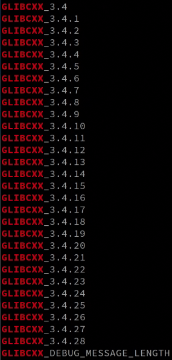

# Ubuntu20.04_ROS环境下OpenCV3和OpenCV4多版本共存


## 一、安装依赖


首先安装`OpenCV3`和`OpenCV4`所需依赖，执行以下指令：

```shell
sudo apt update

sudo apt-get install build-essential cmake git pkg-config libavcodec-dev libavformat-dev libswscale-dev libatlas-base-dev gfortran zlib1g-dev ccache autoconf automake libtool checkinstall

# 添加源
sudo add-apt-repository "deb http://security.ubuntu.com/ubuntu xenial-security main"
sudo apt update
sudo apt install libjasper1 libjasper-dev

# 安装图像和视频库
sudo apt-get install libjpeg-dev libjpeg8-dev libtiff5-dev libjasper-dev libpng-dev
sudo apt install libavcodec-dev libavformat-dev libswscale-dev libv4l-dev
```


## 二、OpenCV和opencv_contrib源码安装


### 2.1 源码下载


本文安装的是`opencv-3.4.6`和`opencv-4.5.5`，可根据需要安装不同的版本，操作一样，如果希望安装相同的版本，可以直接下载本文附带的文件`opencv-3.4.6-build`和`opencv-4.5.5-build`


注：`OpenCV3`需要额外下载第三方文件，相关文件已经放在`3rdparty`文件夹下


自定义下载`OpenCV3`：

```shell
# 注意指定opencv的版本，这里以opencv3.4.6为例
git clone https://github.com/opencv/opencv.git -b 3.4.6
mv opencv opencv-3.4.6-build
cd opencv-3.4.6-build

# 下载opencv_contrib库，注意版本对应，下载到opencv-3.4.6-build文件夹下
git clone https://github.com/opencv/opencv_contrib.git -b 3.4.6
```


同理，自定义下载`OpenCV4`：

```shell
# 注意指定opencv的版本，这里以opencv4.5.5为例
git clone https://github.com/opencv/opencv.git -b 4.5.5
mv opencv opencv-4.5.5-build
cd opencv-4.5.5-build

# 下载opencv_contrib库，注意版本对应，下载到opencv-4.5.5-build文件夹下
git clone https://github.com/opencv/opencv_contrib.git -b 4.5.5
```


### 2.2 源码编译


我们打算将`OpenCV`安装在`~`目录下，也可以安装在`/usr/local/`下，执行以下指令（`OpenCV3`和`OpenCV4`）的操作相同：

```shell
# 新建两个文件夹，作为安装目录
mkdir ~/opencv-3.4.6 && mkdir ~/opencv-4.5.5
```


再分别执行以下指令，这里仅以`opencv-3.4.6`为例，对于`opencv-4.5.5`是类似的，此处省略：

```shell
cd opencv-3.4.6-build
mkdir build && cd build
```


`cmake`步骤很关键，不要采用默认安装的方式，否则会因为覆盖而无法共存。其中，`-DOPENCV_EXTRA_MODULES_PATH`指定`opencv_contrib/modules`的位置，`-DCMAKE_INSTALL_PREFIX`指定`make install`最终安装的位置：

```shell
cmake -DOPENCV_EXTRA_MODULES_PATH=../opencv_contrib-3.4.6/modules \
      -DCMAKE_BUILD_TYPE=RELEASE \
      -DWITH_TBB=ON \
      -DWITH_V4L=ON \
      -DCMAKE_INSTALL_PREFIX=~/opencv-3.4.6 \
      -DBUILD_opencv_vtk=OFF \
      -DWITH_VTK=OFF \
      ..
```


最后编译安装即可：

```shell
# 使用16个CPU核编译
make -j16
sudo make install
```


### 2.3 配置环境变量


打开配置文件，本文使用的是`zsh`，如果是`bash`，则打开`~/.bashrc`：

```shell
sudo vim ~/.zshrc
# sudo vim ~/.bashrc
```


将希望添加的OpenCV库作为默认的OpenCV版本，则在`.zshrc`中添加以下内容：（但是`OpenCV4`没有`pkgconfig`文件）

```shell
# export PKG_CONFIG_PATH=~/opencv-3.4.6/lib/pkgconfig
# export LD_LIBRARY_PATH=~/opencv-3.4.6/lib

export PKG_CONFIG_PATH=~/opencv-4.5.5/lib/pkgconfig
export LD_LIBRARY_PATH=~/opencv-4.5.5/lib
```


为了使`OpenCV4`生效，将`~/opencv-3.4.6/lib/pkgconfig`复制到`~/opencv-4.5.5/lib`下：

```shell
sudo cp -r ~/opencv-3.4.6/lib/pkgconfig ~/opencv-4.5.5/lib
sudo vim ~/opencv-4.5.5/lib/pkgconfig/opencv.pc
```


然后修改`~/opencv-4.5.5/lib/pkgconfig/opencv.pc`中的版本号和名称：

```shell
# Package Information for pkg-config

prefix=~/opencv-4.5.5
exec_prefix=${prefix}
libdir=${exec_prefix}/lib
includedir_old=${prefix}/include/opencv
includedir_new=${prefix}/include

Name: OpenCV
Description: Open Source Computer Vision Library
Version: 4.5.5
Libs: -L${exec_prefix}/lib -lopencv_stitching -lopencv_superres -lopencv_videostab -lopencv_aruco -lopencv_bgsegm -lopencv_bioinspired -lopencv_ccalib -lopencv_dnn_objdetect -lopencv_dpm -lopencv_face -lopencv_freetype -lopencv_fuzzy -lopencv_hdf -lopencv_hfs -lopencv_img_hash -lopencv_line_descriptor -lopencv_optflow -lopencv_reg -lopencv_rgbd -lopencv_saliency -lopencv_stereo -lopencv_structured_light -lopencv_phase_unwrapping -lopencv_surface_matching -lopencv_tracking -lopencv_datasets -lopencv_text -lopencv_dnn -lopencv_plot -lopencv_xfeatures2d -lopencv_shape -lopencv_video -lopencv_ml -lopencv_ximgproc -lopencv_xobjdetect -lopencv_objdetect -lopencv_calib3d -lopencv_features2d -lopencv_highgui -lopencv_videoio -lopencv_imgcodecs -lopencv_flann -lopencv_xphoto -lopencv_photo -lopencv_imgproc -lopencv_core
Libs.private: -ldl -lm -lpthread -lrt
Cflags: -I${includedir_old} -I${includedir_new}
```


最后，使`~/.zshrc`文件生效，执行以下指令：

```shell
source ~/.zshrc
# source ~/.bashrc

pkg-config --modversion opencv
```


### 2.4 编译OpenCV3的常见报错


一般`OpenCV4`编译报错较为简单，这里记录在`Ubuntu20.04`下编译`OpenCV3`时常见的报错


#### 2.4.1 libstdc++版本低


编译时出现以下报错：

**undefined reference to `std::__throw_bad_array_new_length()@GLIBCXX_3.4.29'**


关键在于**GLIBCXX_3.4.29**，在终端输入以下指令：

```shell
strings /usr/lib/x86_64-linux-gnu/libstdc++.so.6 | grep GLIBCXX
```



发现`Ubuntu20.04`的`libstdc++.so.6`最高只到**GLIBCXX_3.4.28**，但是编译需要**GLIBCXX_3.4.29**，因此产生报错


查看`/usr/lib/x86_64-linux-gnu/libstdc++.so.6`的信息，发现其链接的文件是`libstdc++.so.6.0.28`

```shell
ll /usr/lib/x86_64-linux-gnu/libstdc++.so.6
```


因此在系统中全局搜索，查找是否存在比`libstdc++.so.6.0.28`更高版本的文件：

```shell
sudo find / -name "libstdc++.so.6"
```


找到了`~/anaconda3/lib/libstdc++.so.6.0.29`文件


将文件复制到`/usr/lib/x86_64-linux-gnu`目录下，并重新建立链接即可

```shell
# 拷贝文件
cp ~/anaconda3/lib/libstdc++.so.6.0.29 /usr/lib/x86_64-linux-gnu/

# 备份原链接
cd /usr/lib/x86_64-linux-gnu
sudo mv libstdc++.so.6 libstdc++_bak.so.6

# 重新建立链接
sudo ln -s libstdc++.so.6.0.29 libstdc++.so.6
```


检查，有**GLIBCXX_3.4.29**即代表成功

```shell
strings /usr/lib/x86_64-linux-gnu/libstdc++.so.6 | grep GLIBCXX
```


#### 2.4.2 缺少第三方文件


编译时出现以下报错之一：

**fatal error: boostdesc_bgm.i: No such file or directory**

**fatal error: boostdesc_bgm_hd.i: No such file or directory**

**fatal error: boostdesc_bgm_bi.i: No such file or directory**

**fatal error: boostdesc_lbgm.i: No such file or directory**


**fatal error: boostdesc_binboost_064.i: No such file or directory**

**fatal error: boostdesc_binboost_128.i: No such file or directory**

**fatal error: boostdesc_binboost_256.i: No such file or directory**


**fatal error: vgg_generated_48.i: No such file or directory**

**fatal error: vgg_generated_64.i: No such file or directory**

**fatal error: vgg_generated_80.i: No such file or directory**

**fatal error: vgg_generated_120.i: No such file or directory**


原因是缺少第三方文件(3rdparty)，可以直接在本文的附件`3rdparty`中下载，并复制到下面的路径中（根据自己的安装路径修改）：

```shell
~/opencv-3.4.6-build/opencv_contrib-3.4.6/modules/xfeatures2d/src
```


#### 2.4.3 缺少cuda.hpp文件


编译时出现以下报错：

**fatal error: opencv2/xfeatures2d/cuda.hpp: No such file or directory** 或

**fatal error: opencv2/xfeatures2d/cuda.hpp: 没有那个文件或目录**


原因是找不到`cuda.hpp`文件，在`/opencv-3.4.6-build/modules/stitching/CMakeLists.txt`文件中增加如下内容即可（根据自己的安装路径修改）：

```cmake
INCLUDE_DIRECTORIES("~/opencv-3.4.6-build/opencv_contrib-3.4.6/modules/xfeatures2d/include")
```


修改后的`CMakeLists.txt`文件如下：

```cmake
set(the_description "Images stitching")

# 新增部分
INCLUDE_DIRECTORIES("~/opencv-3.4.6-build/opencv_contrib-3.4.6/modules/xfeatures2d/include")

if(HAVE_CUDA)
  ocv_warnings_disable(CMAKE_CXX_FLAGS -Wundef -Wmissing-declarations -Wshadow)
endif()

set(STITCHING_CONTRIB_DEPS "opencv_xfeatures2d")
if(BUILD_SHARED_LIBS AND BUILD_opencv_world AND OPENCV_WORLD_EXCLUDE_EXTRA_MODULES)
  set(STITCHING_CONTRIB_DEPS "")
endif()
ocv_define_module(stitching opencv_imgproc opencv_features2d opencv_calib3d opencv_flann
                  OPTIONAL opencv_cudaarithm opencv_cudawarping opencv_cudafeatures2d opencv_cudalegacy opencv_cudaimgproc ${STITCHING_CONTRIB_DEPS}
                  WRAP python)
```


## 三、cv_bridge安装


`cv_bridge`是 ROS中的一个功能包，用于将ROS的图像消息数据转换为OpenCV库所使用的图像格式，以及将OpenCV库的图像数据转换为ROS的图像消息格式，因此他是使用ROS编译时所必须安装的


### 3.1 源码下载


下载`cv_bridge`源码，注意指定`noetic`分支

```shell
git clone https://github.com/ros-perception/vision_opencv.git -b noetic
```


然后单独取出`cv_bridge`文件夹，复制两份，分别命名为`cv_bridge3-build`和`cv_bridge4-build`，分别用于`OpenCV3`和`OpenCV4`：

```shell
sudo cp ~/vision_opencv/cv_bridge ~
cd ~ && mv cv_bridge cv_bridge3-build

sudo cp ~/vision_opencv/cv_bridge ~
sudo rm -r vision_opencv
cd ~ && mv cv_bridge cv_bridge4-build
```


分别新建两个文件夹，分别用于`OpenCV3`和`OpenCV4`的`cv_bridge`的安装路径：

```shell
cd ~ && mkdir cv_bridge3 && mkdir cv_bridge4
```


### 3.2 源码编译


首先，修改`~/cv_bridge/CMakeLists.txt`，将以下代码注释或删除掉，这里仅以`opencv-3.4.6`为例，对于`opencv-4.5.5`是类似的，此处省略：

```cmake
set(_opencv_version 4)
find_package(OpenCV 4 QUIET)
if(NOT OpenCV_FOUND)
  message(STATUS "Did not find OpenCV 4, trying OpenCV 3")
  set(_opencv_version 3)
endif()

find_package(OpenCV ${_opencv_version} REQUIRED
  COMPONENTS
    opencv_core
    opencv_imgproc
    opencv_imgcodecs
  CONFIG
)
```


替换成以下内容：（注：`OpenCV4`的**OpenCV_DIR**路径和`OpenCV3`不同，主要是找`OpenCVConfig.cmake`文件，看注释）

```cmake
# 如果是OpenCV4，则第一行修改为下面这一行
# set(OpenCV_DIR ~/opencv-4.5.5/lib/cmake/opencv4)
set(OpenCV_DIR ~/opencv-3.4.6/share/OpenCV)
set(OpenCV_INCLUDE_DIRS ~/opencv-3.4.6/include)
set(OpenCV_LIBRARIES ~/opencv-3.4.6/lib)

find_package(OpenCV 3 REQUIRED
  COMPONENTS
    opencv_core
    opencv_imgproc
    opencv_imgcodecs
  CONFIG
)
```


然后执行以下指令：

```shell
cd cv_bridge3_build
mkdir build && cd build
cmake -D CMAKE_INSTALL_PREFIX=~/cv_bridge3 ..

# OpenCV4：
# cmake -D CMAKE_INSTALL_PREFIX=~/cv_bridge4 ..
```


### 3.3 安装/编译cv_bridge的常见报错


`cmake`时出现以下报错：

**Could not find a configuration file for package "boost_python" that exactly matches requested version "1.82.0".** 
**The following configuration files were considered but not accepted:** 
**/usr/lib/x86_64-linux-gnu/cmake/boost_python-1.71.0/boost_python-config.cmake,** 
**version: 1.71.0 /lib/x86_64-linux-gnu/cmake/boost_python-1.71.0/boost_python-config.cmake, version: 1.71.0**


**Could NOT find Boost (missing: python) (found version "1.82.0")**


原因是`cmake`时需要`boost_python-1.82.0`，但是只找到了`boost_python-1.71.0`，即`boost_python`版本低，此时需要安装所需的版本（[boost官方下载链接](https://www.boost.org/users/history/)），根据报错，本文下载的是 [VERSION 1.82.0](https://boostorg.jfrog.io/artifactory/main/release/1.82.0/source/) 版本，解压到`~`目录


然后执行以下指令运行安装脚本：

```shell
cd ~/cd boost_1_82_0

# 明确指定Python路径
sudo ./bootstrap.sh --with-python=/usr/bin/python3

# 也可以指定安装路径，默认安装在系统中：/usr/local
# sudo ./bootstrap.sh --prefix=/usr/local --with-python=/usr/bin/python3
```


执行以下指令，会安装在本地，**linker：**`~/boost_1_82_0/stage/lib`，**include：**`~/boost_1_82_0`

```shell
sudo ./b2
```


执行以下指令，会安装到系统中或`--prefix`指定的路径中

```shell
sudo ./b2 install
```


如果需要，执行以下指令来确保系统正确找到新安装的库文件

```shell
sudo ldconfig
```


附：`Boost`的`CMakeLists.txt`路径设置：

```cmake
set(Boost_DIR ~/boost_1_82_0/stage/lib)
set(BOOST_INCLUDE_DIRS ~/boost_1_82_0)
set(BOOST_INCLUDEDIR ~/boost_1_82_0)
```


## 四、在ROS中编译时搭配CMake使用方法


在`CMakeLists.txt`中指定`OpenCV`和`cv_bridge`的路径（主要是`OpenCVConfig.cmake`和`cv_bridgeConfig.cmake`两个文件）


`OpenCV3`的设置如下：

```cmake
# OpenCV3：
set(cv_bridge_DIR ~/cv_bridge3/share/cv_bridge/cmake)
set(OpenCV_DIR ~/opencv-3.4.6/share/OpenCV)
```


`OpenCV4`的设置如下：

```cmake
# OpenCV4：
set(cv_bridge_DIR ~/cv_bridge4/share/cv_bridge/cmake)
set(OpenCV_DIR ~/opencv-4.5.5/lib/cmake/opencv4)
```

